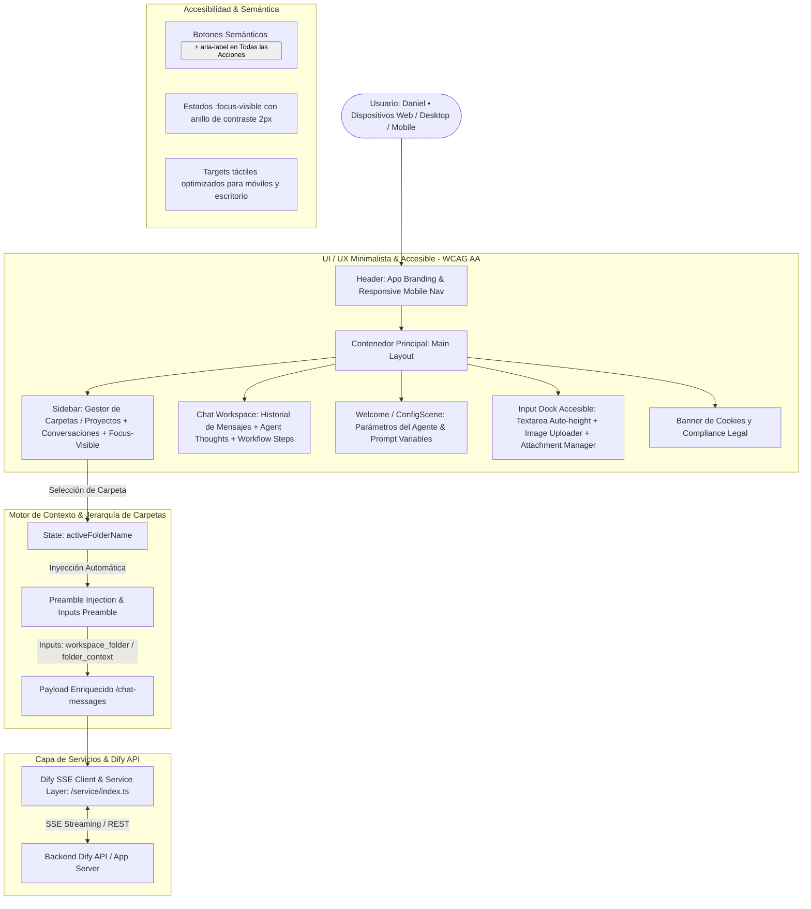

# PROJECT MAP — AGENTE CREADOR DE WEBS

## 1. Topología del Sistema (Mermaid Graph)

## 2. Componentes Clave & Modificaciones
- **Gestión de Contexto de Carpeta (`app/components/sidebar/index.tsx`, `app/components/index.tsx`):**
  - Sistema de Carpetas y Proyectos con persistencia en `localStorage`.
  - Inyección en tiempo real del contexto de la carpeta activa tanto en las variables `inputs` (`active_folder`, `workspace_folder`, `folder_context`) como en el preámbulo de la consulta `[Contexto Carpeta: "..."]`.
- **Accesibilidad y Semántica (`app/components/base/button/index.tsx`, `app/components/header.tsx`, `app/components/chat/index.tsx`, `app/components/chat/answer/index.tsx`):**
  - Reemplazo de elementos interactivos `
` por `<button type="button">` semánticos.
  - Atributos `aria-label` descriptivos en todos los controles interactivos (subida de archivos, alternar menús, envío de mensajes, feedback like/dislike, gestión de carpetas).
  - Estilos `:focus-visible` universales para navegación completa por teclado (Tab / Enter / Space).
- **Diseño Minimalista & Paleta Limpia (`app/styles/globals.css`, `app/components/sidebar/index.tsx`, `app/components/header.tsx`):**
  - Fondos neutros de baja distracción con bordes sutiles, microinteracciones fluidas y tipografía semántica legible.
